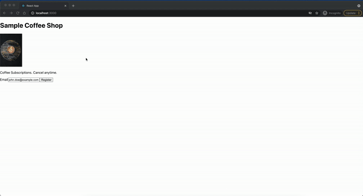

# Direct Debit Mandate and Subscriptions

Create a direct debit mandate and subscription for an online service.
This sample shows how to create a customer, set up mandate for recurring use, and subscribe them to a subscription plan

**Demo**



### Features:

- Create a customer and setup mandate
- Subscribe the customer to a subscription plan

## How to run locally

This sample includes (server/) in NodeJS. Follow the steps below to run one of the servers locally. The client is a React app. Follow the instructions below to get them running.

Copy the `.env.example` file into a file named `.env` in the folder of the server you want to use. For example:

```
cp .env.example server/node/.env
```

You will need a GoCardless account in order to run the demo. Once you set up your sandbox account, go to the Dashboard [developer dashboard](https://manage-sandbox.gocardless.com/developers/access-tokens/create) and create access token.

```
GOCARDLESS_ACCESS_TOKEN=<replace-with-your-access-token>
```

**Run react frontend client**

```
cd client
npm install
npm start
```

**Follow the server instructions on how to run:**

Pick the server language you want and follow the instructions in the server folder README on how to run.

```
cd server/node # there's a README in this folder with instructions
npm install
npm run dev
```
